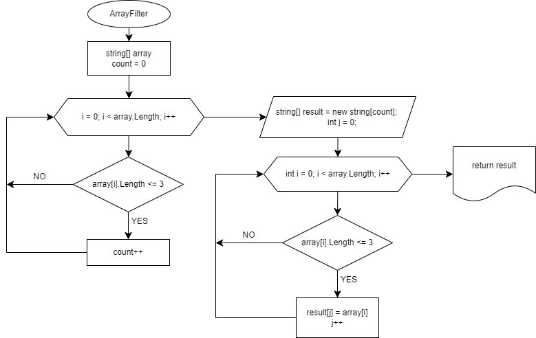

# Итоговая контрольная работа по основному блоку
## Задание
Написать программу, которая из имеющегося массива строк формирует новый массив из строк, длина которых меньше, либо равна 3 cимволам. Первоначальный массив можно ввести с клавиатуры, либо задать на старте выполнения алгоритма. При решении не рекомендуется пользоваться коллекциями, лучше обойтись исключительно массивами.

## Примеры:
```
[“Hello”, “2”, “world”, “:-)”] → [“2”, “:-)”]
[“1234”, “1567”, “-2”, “computer science”] → [“-2”]
[“Russia”, “Denmark”, “Kazan”] → []
```
## Блок-схема алгоритма


## Описание алгоритма
1. Метод ***ArrayFilter*** для массива строк: 
* Исходный массив **array**. Для определения длины результирующего массива проверяем строки проверяем каждый элемент массива. Если длина строки меньше или равна 3-м знакам, то счетчик **count** увеличивается на 1. 
* Создаем пустой строковый массив **result**, длина которого равна **count**. 
* Заполняем массив **result** значениями массива **array**, длина которых меньше или равна 3-х символов.
* Возвращаем строковый массив **result**
2. Метод ***PrintArray*** выводит значение массива **result** на консоль.